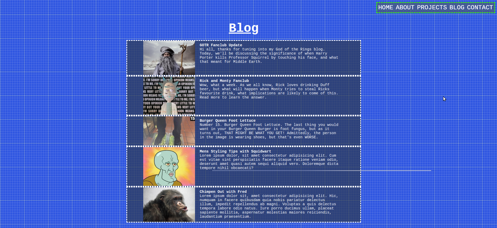
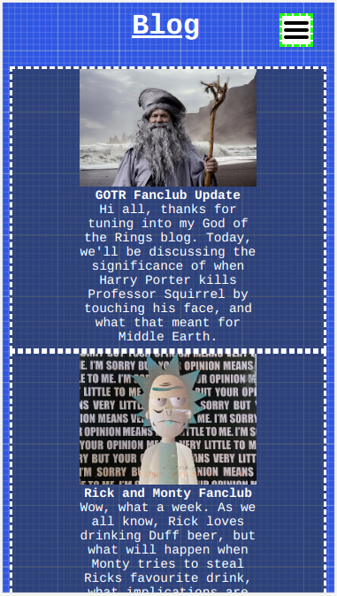

# T1A2 Portfolio
#### Dean Raguso

### URL

https://thirsty-payne-a89174.netlify.app

## Description
This is a portfolio website, with the purpose of presenting my skills and background to professionals I might work for or with. The website alone should be pleasant to use and responsive, as a showcase of my abilities as a web developer.

The initial concept is to make it look clean and mechanical, using as many tricks in CSS as possible to make the site interactive feeling in absense of JS. The typefont will be "Courier New" like, I want to achieve a techy vibe with the site.

### Features
- Flex-box used throughout, to allow for controlled container resizing with different window sizes.
- Media queries, to improve the sites appearance on smaller devices.
- All CSS burger drop-down menu, clean and fast visual navigation for mobile sized devices.

### Sitemap
Created on: https://octopus.do/

### Screenshots
#### Homepage

#### Projects

#### About

#### Blog

#### Contact

### Target Audience
This website will likely be linked to my professional resume at some point, therefore, my target audience with be people in the Web / Software Development sphere.

Because of this, my design should get the basics right! Responsive, fast to load, clean, above all other features I wish to add. To make it more impressive, I will add trickier to implement features, such as drop-down menus and carasels to flick through information without any sort of scroll bar, although perhaps not within this assessment.

### Technology Stack
- Made using CSS and HTML.
- Written in Visual Studio Code.
- Version controlled using git.
- Repository will be stored remotely on Github.
- Hosted via Netlify.

Some other applications I used:
- Balsamiq Wireframes for Wireframes.
- LibreOffice for ppt slides.
- Octopus.do for the sitemap.
  

