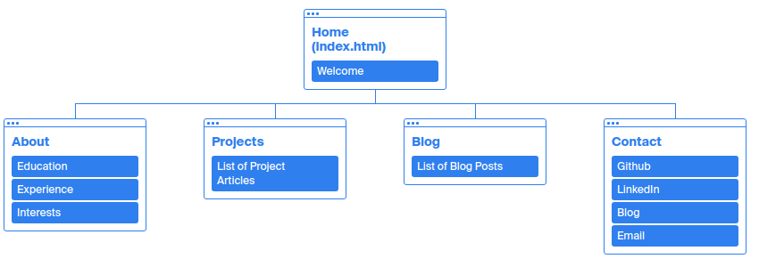
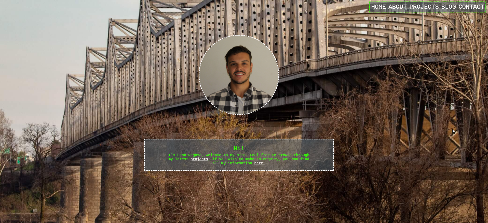
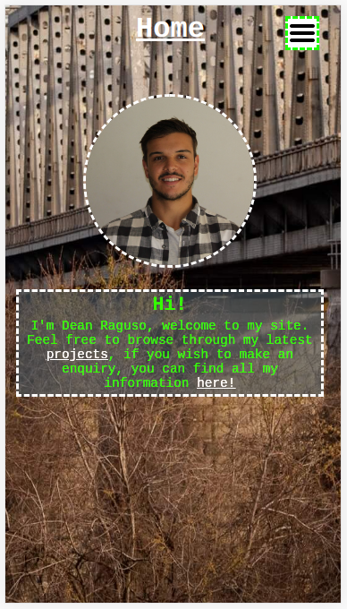
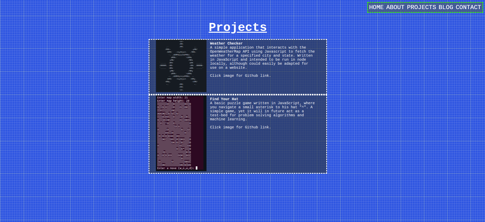
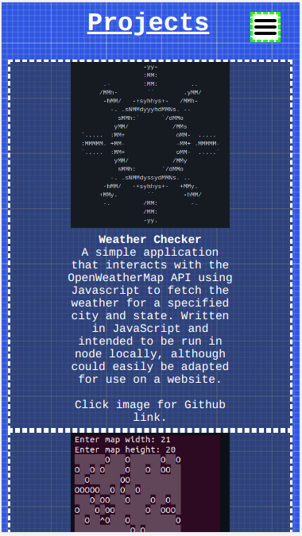
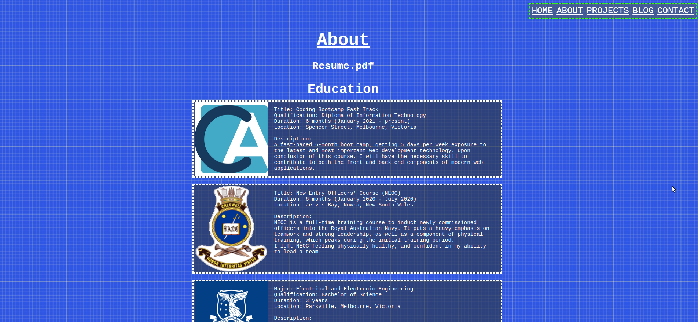
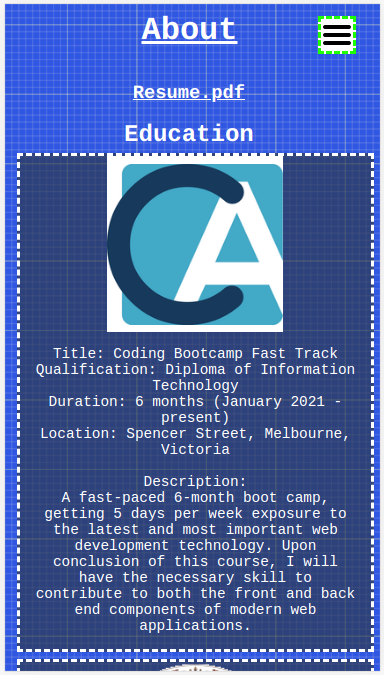
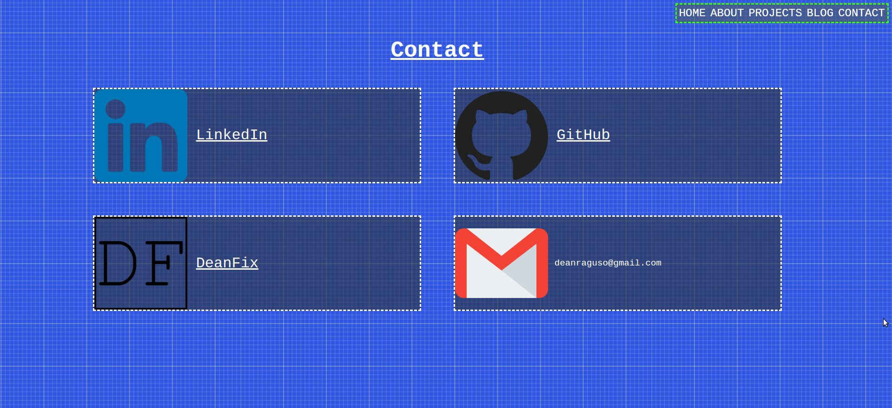
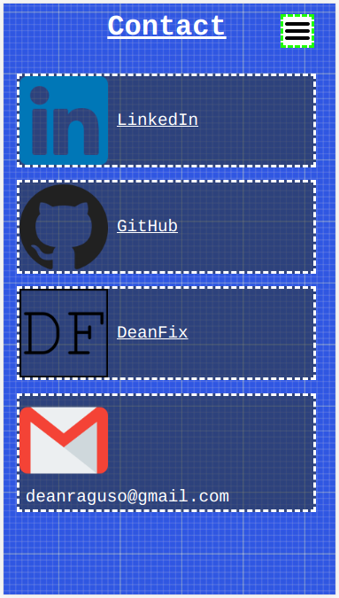

#### Dean Raguso

## Description
This is a portfolio website, with the purpose of presenting my skills and background to professionals I might work for or with. The website alone should be pleasant to use and responsive, as a showcase of my abilities as a web developer.

### Features
- Flex-box used throughout, to allow for controlled container resizing with different window sizes.
- Media queries, to improve the sites appearance on smaller devices.
- All CSS burger drop-down menu, clean and fast visual navigation for mobile sized devices.

### Sitemap
Created on: https://octopus.do/

### Screenshots
#### Homepage

#### Projects

#### About

#### Contact

